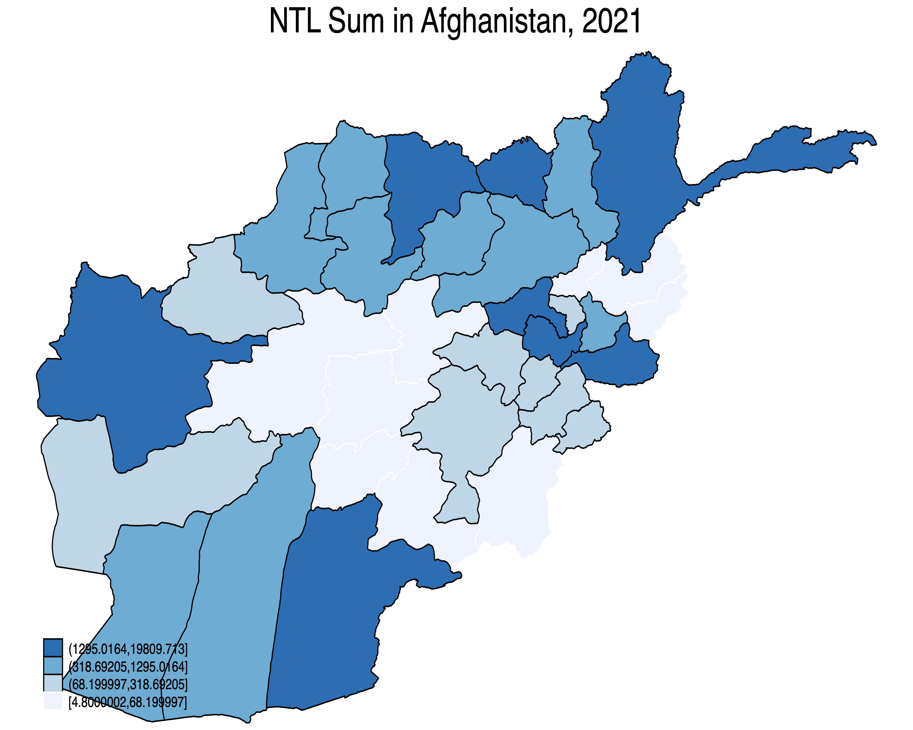

# statasat - Query nighttime lights data

## Content

__statasat__ faciliates querying nighttime lights data.

## Install and update

```stata
net install statasat , from("https://raw.githubusercontent.com/ramarty/stata-satellite/master/src") replace
```

## Usage

### Download aggregated dataset of nighttime lights

```stata
query_satellite_data, geo_dataset("gadm_410") adm_level("ADM_1") iso("AFG") ///
                      sat_dataset("blackmarble") /// 
                      date_unit("annual") date_start("2021") date_end("2021") ///
                      file_name("~/Desktop/afg_annual_2021.dta")
```

### Download spatial files

The package also enables querying the spatial files used for aggregation. `query_shp` can be used to download a shapefile and `query_geojson` can be used to download a geojson.

```stata
* Download shapefile
query_shp, geo_dataset("gadm_410") adm_level("ADM_1") iso("AFG") \\\
           file_name("~/Desktop/afg_adm1.shp")

* Download geojson
query_geojson, geo_dataset("gadm_410") adm_level("ADM_1") iso("AFG") \\\
               file_name("~/Desktop/afg_adm1.geojson")
```

## Example: Make a map of nighttime lights

The below example illustrates making a map of nighttime lights

```stata
* Example of Making a Map

clear all

* Install packages -------------------------------------------------------------
* net install statasat , from("https://raw.githubusercontent.com/ramarty/stata-satellite/master/src") replace
* ssc install spmap, replace      // Install spmap if not already installed
* ssc install shp2dta, replace    // Install shp2dta if not already installed

* Download data ----------------------------------------------------------------
query_satellite_data, geo_dataset("gadm_410") adm_level("ADM_1") iso("AFG") ///
					  sat_dataset("blackmarble") ///
					  date_unit("annual") date_start("2021") date_end("2021") ///
					  file_name("~/Desktop/afg_annual_2021.dta")
						  
query_shp, geo_dataset("gadm_410") adm_level("ADM_1") iso("AFG") file_name("~/Desktop/afg_adm1.shp")

* Prep data for map ------------------------------------------------------------

* Load NTL data
use "~/Desktop/afg_annual_2021.dta", clear

* Convert Shapefile to Stata Format
shp2dta using "~/Desktop/afg_adm1.shp", database(afg_db) coordinates(afg_coord) genid(id) replace

* Load the shapefile attribute data
use afg_db, clear

* Merge with your Stata dataset on GID_1
merge 1:1 GID_1 using "~/Desktop/afg_annual_2021.dta"

* Drop merge indicator if needed
drop _merge

* Make map ---------------------------------------------------------------------

* Generate the map
spmap ntl_sum using afg_coord, id(id) fcolor(Blues) ocolor(white) clmethod(quantile) title("NTL Sum in Afghanistan, 2021")
    
* Save the map as a PNG file
graph export "~/Desktop/afg_ntl_map.png", replace width(2000) height(1600)
```

<p align="center">

</p>
